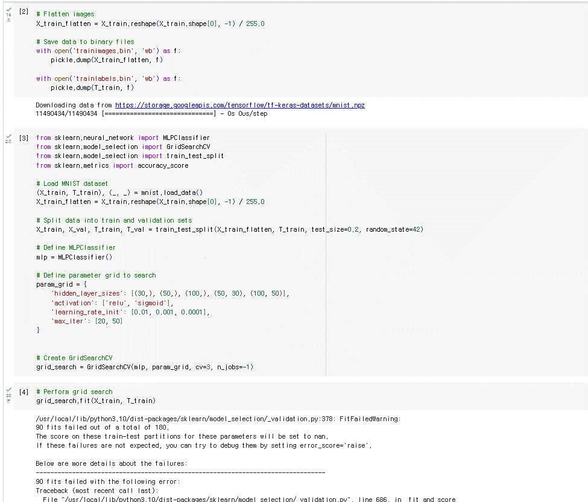
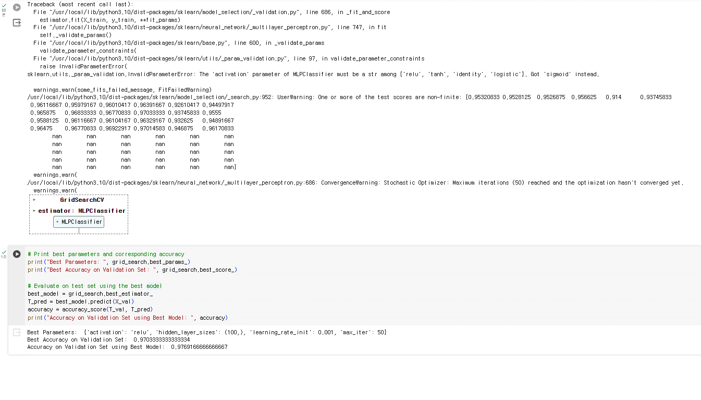

# 🖊️ Handwritten Digit Recognition with Neural Network
손글씨 숫자 인식을 위한 신경망 구현 (Python & Numpy)

## 📌 프로젝트 개요
이 프로젝트는 손글씨 숫자 인식 (Handwritten Digit Recognition)을 위한 다층 퍼셉트론 신경망 (MLPClassifier)와 직접 구현한 커스텀 신경망을 활용하여 MNIST 스타일의 데이터를 학습하고 예측하는 모델을 개발한 것입니다.

Google Colab에서 처음 작성되었으며, 이후 VS Code 환경에서도 실행할 수 있도록 조정되었습니다. 또한, 직접 손으로 그린 숫자 이미지도 예측할 수 있도록 확장했습니다.

---

## 🕒 개발 히스토리
- 📌 **최초 작성:** 2023년 12월 12일 (Google Colab)
- 📌 **업데이트:** 2025년 3월 (VS Code 환경에서 실행 가능하도록 수정)
- 📌 **Google Drive에서 관리 → GitHub 레포지토리로 옮겨 지속적 업데이트**
- 📌 **Colab에서의 학습 과정 캡처(GIF) (`gscv2.gif`, `gscv2_2.gif`) 포함**
- 📌 **MNIST 데이터셋에 대해 Random Search로 최적 파라미터 탐색**

---

## 📂 프로젝트 폴더 구조
```
📂 dataset                 # 데이터 관련 폴더
 ├── trainlabels.bin       # 학습 데이터 라벨
 ├── trainimages.bin       # 학습 데이터 이미지
 ├── testlabels.bin        # 테스트 데이터 라벨
 ├── testimages.bin        # 테스트 데이터 이미지
 ├── test.png              # 손글씨 숫자 5 이미지 (예측 테스트용)
 ├── test.bin              # 테스트 이미지의 바이너리 데이터
 ├── sample_images/        # 직접 그린 손글씨 숫자 이미지 (0~9)
 │    ├── 0/  (0번 손글씨 숫자 4개)
 │    ├── 1/  (1번 손글씨 숫자 4개)
 │    ├── ...  
 │    ├── 9/  (9번 손글씨 숫자 4개)

📂 model                   # 모델 학습 & 결과 저장 폴더
 ├── learningdata.npz      # 학습된 가중치 저장

📂 scripts                 # 코드 관련 폴더
 ├── learning_book.py      # 신경망 학습 코드 (Colab에서 작성 후 VS Code에서 실행 가능하도록 수정)
 ├── predict_book.py       # 손글씨 숫자 예측 코드
 ├── accuracy_check.py     # 전체 테스트 데이터셋 정확도 계산
 ├── predict_custom_1.py   # 특정 테스트 이미지에 대한 예측 및 시각화
 ├── predict_custom_2.py   # 직접 그린 손글씨 숫자 예측
 ├── predict_custom_3.py   # 여러 사용자 손글씨 이미지 일괄 예측 및 확률 시각화
gscv2.gif                  # Google Colab에서 MNIST 데이터로 Random Search(은닉노드, 학습률, epoch 등)
gscv2_2.gif                # Google Colab에서 MNIST 데이터로 Random Search(은닉노드, 학습률, epoch 등)
📄 README.md               # 프로젝트 설명 파일
📄 MNIST_4.ipynb           # Google Colab에서 진행한 학습 및 Random Search 실험
```
> **📌 참고:** `trainlabels.bin`, `trainimages.bin`, `testlabels.bin`, `testimages.bin` 용량이 커서 `dataset.zip` 형태로 보관 중.

---

## 🚀 주요 기능

### 1️⃣ 학습 (Training)
- `scripts/learning_book.py` 실행 시 MNIST 데이터셋을 학습하고, 결과를 `model/learningdata.npz`에 저장합니다.
- **ReLU + Softmax + Cross Entropy** 기반으로 구현되어, 약 97~98% 정확도를 달성합니다.

### 2️⃣ 정확도 평가 (Accuracy Check)
- `scripts/accuracy_check.py`를 통해 MNIST 테스트 데이터셋에 대한 정확도를 확인합니다.
- 학습 시 최대 약 97% 후반의 정확도를 달성.

### 3️⃣ 손글씨 예측 (Prediction)
- **`predict_book.py`** : 예컨대 `test.png`나 `sample_images/9/9_4.png` 등 임의 이미지를 입력받아 예측
- **`predict_custom_1.py`** : `testimages.bin`(MNIST 테스트셋)에서 특정 인덱스 이미지를 골라 예측
- **`predict_custom_2.py`** : 직접 그린 손글씨 1장(`0_1.png` 등)을 불러와 예측
- **`predict_custom_3.py`** : `sample_images/` 폴더 내 여러 PNG 이미지를 순회하며 예측, 예측 확률을 시각화

---

## 🔨 추가 사항
| 파일명                 | 주요 내용                                                                 |
|------------------------|------------------------------------------------------------------------------|
| `learning_book.py`     | MNIST 학습 과정에서 ReLU+Softmax+CrossEntropy를 적용하고, seed=10 등으로 실행 |
| `accuracy_check.py`    | 동일 구조로 테스트 데이터 정확도 계산 (ReLU+Softmax)                          |
| `predict_book.py`      | 임의의 PNG(사용자 손글씨 등) 이미지 1장 예측                                   |
| `predict_custom_1.py`  | MNIST 테스트세트(.bin) 중 특정 인덱스 1장 예측                                  |
| `predict_custom_2.py`  | 사용자 손글씨 이미지 1장 예측                                                 |
| `predict_custom_3.py`  | 사용자 손글씨 여러 장(0_1,0_2..9_4 등) 일괄 예측, 확률 시각화                  |
| `MNIST_4.ipynb`        | Google Colab에서 MNIST 데이터로 Random Search(은닉노드, 학습률, epoch 등)      |

---

## 🎯 Random Search 결과와 실제 학습 파라미터의 차이

**MNIST_4.ipynb**에서 Random Search로 찾은 최적 파라미터(예: `(hidden=100, eta=0.01, max_iter=50)`)와,
`scripts/learning_book.py`에서 실제 사용하는 파라미터(`(hidden=100, eta=0.001, max_iter=100)`)가 다를 수 있습니다. 그럼에도 더 높은 정확도가 나오는 것은 아래와 같은 이유 때문입니다:

1. **데이터 분할** : Random Search는 Train(80%) + Val(20%)로 나누어 검증 정확도를 측정해 최적 파라미터를 찾는 반면, `learning_book.py`는 **전체 60000장**을 모두 사용해 학습 → 데이터가 많아 더 좋은 결과 가능.
2. **학습 Epoch** : Random Search는 최대 epoch=50까지만 학습하지만, `learning_book.py`에서는 epoch=100까지 학습 → 더 충분한 학습으로 정확도 상승.
3. **학습률(eta)** : 0.01이 빠른 수렴을 줄 수 있지만 overshoot 위험도 있으며, 0.001은 느리지만 더 안정적으로 수렴 → 결과적으로 더 높은 정확도.
4. **난수 시드 & 초기화** : 가중치 초기화가 랜덤이기 때문에, 우연히 더 좋은 초기값으로 학습될 수도 있음.
5. **결론** : 약간의 정확도 차이는 정상 범위이며, 최종 모델 배포 시에는 보통 Train+Val 전체 데이터와 충분한 epoch로 재학습하여 더 높은 정확도를 얻는 경우가 많습니다.

---

## 📊 Google Colab
| Google Colab_1 | Google Colab_2 |
|-----------|---------------|
|  |  |

---

## 🎯 최종 결과 (VS Code에서 실행된 결과)
- 🔹 **테스트 데이터셋 정확도:** 최대 97~98% 달성
- 🔹 **test.png 예측 결과:** (예: 5)
- 🔹 **특정 테스트 이미지 예측 결과:** (예: index=11 → 6)
- 🔹 **사용자 손글씨 예측 결과:** 정확히 인식(예: `0_1.png → 0`, etc.)

---

## 🏠 마무리
**이 프로젝트**는 Google Colab에서 개발한 코드를 VS Code 환경으로 이식하여, MNIST 및 사용자 손글씨 이미지를 인식하는 과정을 시도했습니다. Random Search를 통해 얻은 파라미터와 실제 학습 파라미터 사이에 오차가 있지만, 이는 난수 초기화, 데이터 분할, 학습률/epoch 차이에서 기인한 것으로 MNIST에서는 정상적인 현상입니다.

추후에는 **Ensemble 기법**이나 **데이터 증강** 등으로 정확도를 더 올려볼 수 있습니다.

---

